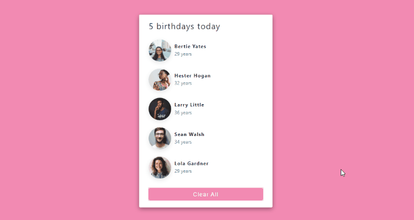

## Birthday Reminder App

### Illustration

### Implementation

-  Loading a list of items from a data file into component state when component mounts.
-  Passing state as props to a child component.
-  Rendering list of items in a component.
-  Creating a function to clear the state of a component by clicking a button
